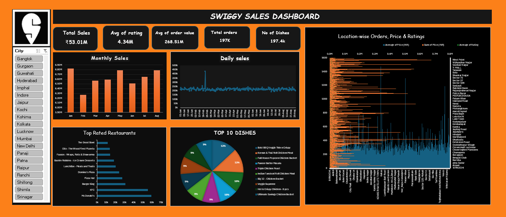

# Swiggy Sales & Restaurant Performance Analysis

## Project Overview

This project analyzes Swiggy sales and restaurant performance data using Power BI.

The dashboard provides insights into sales trends, order performance, restaurant ratings, dish popularity, and location-wise performance.

## Dashboard

## Key Metrics

- Total Sales: ₹53.01M
- Average Rating: 4.34
- Average Order Value: ₹268.51
- Total Orders: 197K
- Number of Dishes: 197.4K

## Key Analysis

### Monthly Sales
Analyzed monthly sales trends to identify changes in revenue across different months.

### Daily Sales
Reviewed daily sales performance to understand sales patterns and fluctuations.

### Top Rated Restaurants
Identified restaurants with the highest ratings and compared their performance.

### Top 10 Dishes
Analyzed the most popular dishes based on order and sales performance.

### Location-wise Analysis
Compared orders, prices, and ratings across different cities and locations.

## Tools Used

- Power BI
- Data Visualization
- Data Analysis
- DAX

## Skills Demonstrated

- Dashboard Development
- KPI Analysis
- Data Visualization
- Trend Analysis
- Restaurant Performance Analysis
- Business Insights
- Interactive Filtering

## Project Objective

The objective of this project is to transform Swiggy sales data into an interactive dashboard that helps understand sales performance, customer preferences, restaurant ratings, and location-wise trends.
