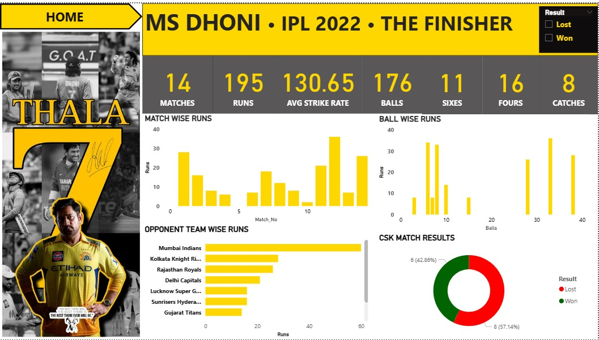
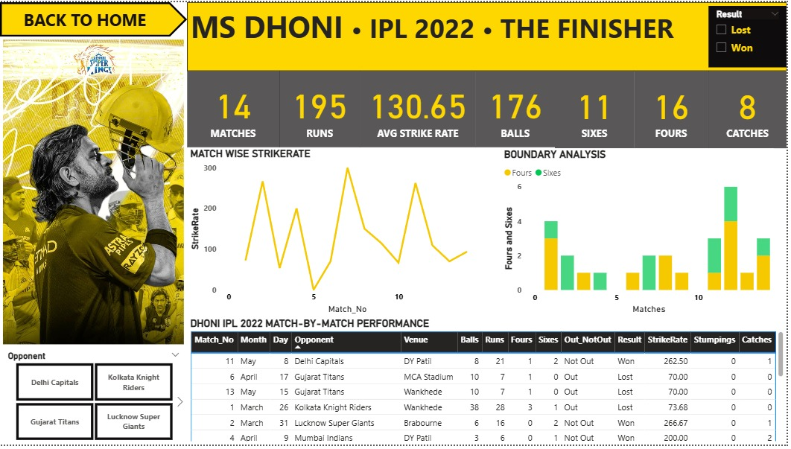

# MS Dhoni IPL 2022 Performance Analysis

## Project Overview

An interactive Power BI dashboard developed to analyze MS Dhoni's batting performance during the IPL 2022 season.

The dashboard provides insights into match-wise performance, runs, strike rate, boundaries, opponent-wise performance, and CSK match results.

## Dashboard

### Dashboard Page 1

### Dashboard Page 2

## Key Metrics

- Matches: 14
- Runs: 195
- Average Strike Rate: 130.65
- Balls Faced: 176
- Sixes: 11
- Fours: 16
- Catches: 8

## Key Analysis

### Match-wise Performance

Analyzed MS Dhoni's runs and strike rate across individual IPL 2022 matches to understand consistency and high-impact performances.

### Boundary Analysis

Analyzed the distribution of fours and sixes across matches to identify Dhoni's boundary-scoring contribution.

### Opponent-wise Performance

Compared Dhoni's batting performance against different IPL teams, highlighting teams against which he scored more runs.

### Match Results

Analyzed CSK's match results during IPL 2022 and compared wins and losses.

## Tools Used

- Power BI
- Data Visualization
- Data Analysis
- Microsoft Excel

## Skills Demonstrated

- Data cleaning and preparation
- KPI development
- Interactive dashboard design
- Data visualization
- Performance analysis
- Business-style storytelling with data

## Project Outcome

The dashboard provides a visual analysis of MS Dhoni's IPL 2022 performance and demonstrates how Power BI can be used to transform sports data into meaningful insights.
